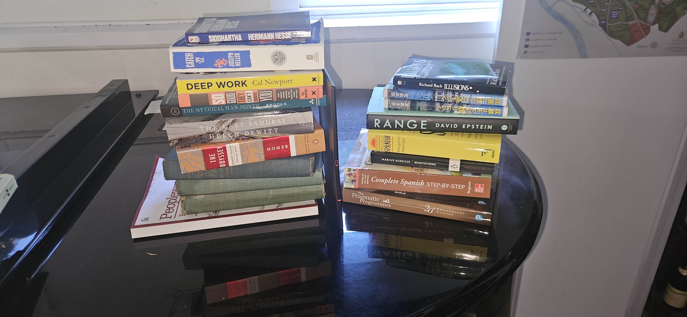

I have read more books so far this year than any year in my life, at least since elementary school.

> 
> ##### Every (physical) book I read this year

I figured now would be a good time to write some short rapid fire reviews so that I don't let them "pass me by". And a haiku for each too. (Technically senryuu since they are *not* seasonal)

Approximately in the order I read them in:

1. **The Odyssey** - *Homer* - I read "The Iliad" last year so this was the obvious followup. I was surprised by the structure of the story, how it weaves between Telemachus and Odysseus in the present as well as Odysseus in the past. It is not straightforward (Wily even) but it flows so beautifully.
    > Man of twists and turns\
    > At last Ithica Homebound\
    > Pallas Athena

1. **Deep Work** - *Cal Newport* - Funnily enough I got recommended this one by an LLM. Mr. Newport convinced me to give up social media with this one for which I am much happier. More generally I think it helped me better realize *what* I want in a career. 
   > Focus more often\
   > Societies distracted\
   > Do less shallow stuff

2. **So Good They Can't Ignore You** - *Cal Newport* - I got this one as a bundle with Deep Work and found the argument slightly less appealing than that one, but still with its own nuggets of wisdom. 
   > Don't follow passion\
   > Build up career capital\
   > Then passion follows

3. **The Pragmatic Programmer** - *David Thomas and Andrew Hunt* - I found out about this book from Deep Work. I really loved this one. The title doesn't lie; it is full of pragmatic advice both literal and psychological to be a better programmer.
   > Think like a craftsman\
   > Take pride in the work you do\
   > Use version control

4. **Catch 22** - *Joseph Heller* - It's a classic for a reason. I laughed out loud quite a few times reading it. The non linear narrative is brilliant. Not much to say that hasn't already been said about this book.
   > Just Five more missions\
   > They say for the fifteenth time\
   > Yossarian Lives!

5. **Meditations** - *Marcus Aurelius* - I expected to enjoy this one a lot more than I did. I don't think much of my dissatisfaction in life comes from being too easily swayed by emotion but in many ways the opposite.
   > Live Virtuously\
   > There is goodness inside you\
   > Only Focus there

6. **Madrigal's Magic Key To Spanish** - *Margarita Madrigal* - An Ok introduction to Spanish, better than Duolingo but I don't think its really the optimal way to spend your time studying Spanish. It wasn't mine.
   > No nos presento\
   > El pronombre 'tu' desde\
   > La seccion final

7. **Notes from Underground** - *Fyodor Dostoevsky* - I related deeply to this book. Changed my perspective on life. In many ways I am the underground man, but after reading this book I realise I have a choice.
   > I will prove them wrong\
   > they will ask my forgiveness\
   > twenty years have passed

8. **成瀬は天下をとりにいく** - *宮島みな* - this is the first book I read in Japanese and for that I am very fond of it. It was about the most popular book in japan in 2025. Its a very sweet book in the second person about a precocious teenage girl in Shiga.
    > さよ西武\
    > お笑いテレビ\
    > 頭剃る

9. **成瀬は信じた道を行く** - *宮島みな* - The second book in the trilogy (I haven't read the 3rd even though I have it :( ). More second person stories of Naruse. I think stories like this help you realize how much you touch other people's lives. Very empathetic. 
    > 大使なり\
    > 京都大学\
    > 膳所まわる

10. **Illusions** - *Richard Bach* - interesting 70s spirituality thing. I like the quote "It will take years of practice before you give yourself permission to do it right, before your self-conscious mind tells you that you have suffered enough to have earned the right to play well." Its a good a approach to mastery.
    > flying messiah\
    > theres nothing he cannot do\
    > nonetheless must die

11. **The Subtle Art of Not Giving a F\*ck** - *Mark Manson* - Listened to this one on a road trip with friend. With anything in the "self help" realm you take some and you leave some. I do like the principle of inversion. I could only start to appreciate the things i wanted when I stopped wanting them
    > choose the fucks you give\
    > struggle free lives don't exist\
    > act first think later

12. **Dungeon Crawler Carl Series** - *Matt Dinniman* - I'm wrapping these all up in one cause it kind of became my obsession for 2 weeks and i didn't do anything else besides listening to them. Positively addicting like a video game, but not what i needed at that moment, oh well.
    > God damn it donut\
    > system ai is breaking\
    > quirky characters

13. **Siddhartha** - *Herman Hesse* - I found this one through Mark Manson and [Jesse Welles](<https://www.youtube.com/watch?v=ah1-aR2ILxc>). Absolutely beautiful novel. It speaks to the importance of finding wisdom yourself. Ultimately I don't think it can be derived from any one master.
    > Guy in yellow cloak\
    > Become a very rich man\
    > Back to the river
    

14. **The Happiness Advantage** - *Shawn Achor* - I read this one at the recommendation of my therapist. I liked it all right. At the time I was thinking about what use my pessimism had and how to think better and I think this book crystallized those thoughts in a satisfying way. Perhaps its my own prejudice but I feel it is guilty of "Harvard Prose" which is hard to describe but seems to permeate the literature from there. A tinge of smugness perhaps?
    > First become happy\
    > Then success follows later\
    > Have a growth mindset

15. **Lessons For Living** - *Phil Stutz* - Another therapist recommendation. This one also helped distill some thoughts I was having about "thinking good". In the past I've been very cynical about things like "spirituality" and "manifesting". This book helped me realize that whether those things are "real" or not is more up to you than some hypothetical objective scientific instrument that can measure it. Life is not an objective experience. The shadow and Part X concepts are useful tools.
    > Keep your momentum\
    > Accept that life will have pain\
    > Battle your part X.

16. **The Mythical Man Month** - *Frederick P. Brooks, Jr.* - This one I read at the recommendation of "The Pragmatic Programmer". It was written about programming and computer engineering projects in the 70s but a crazy amount of it still holds up. The challenges of knowledge work stay the same in a lot of ways. AI can't really solve the problems of communication between stakeholders in a product.
    > Make good project teams\
    > Communication is key\
    > Debugging is hard

16. **Range** - *David Epstein* - In many ways this book was making the counterargument to "So Good They Can't Ignore You". I don't think I am entirely convinced by either one, you have to take these things in moderation. Having a variety of experience is not the end all be all either. I do like his idea of "Kind" and "Wicked" learning environments. It seems that AI will inevitably be able to do all the "Kind" learning environment things.
    > Try out lots of stuff\
    > Have Adaptability\
    > The real world is tough.

17. **Love and Limerence** - *Dorothy Tennov* - I read this for personal reasons cause I felt it an emotion I was feeling thoroughly and unsentimentally. It has gotten me interested in psycho-analysis more.
    > Objectify those\
    > That we think we really love\
    > How stressful indeed

17. **Complete Spanish Step-By-Step** - *Barbara Bregstein* - I did this textbook every day through May and June and felt it was very good and thorough. It is boring in a good way -- not trying to reinvent the wheel, just telling you what you need to know and reinforcing that knowledge.
    > No tengo nada\
    > Que decir sobre esto\
    > Es un buen libro

17. **The Lord of the Rings** - *JRR Tolkien* - It was my first time reading The Lord of The Rings. I get it now. The books are so rich and well done.
    > To Mordor they go\
    > They help Rohan and Gondor\
    > Aragon returns

18. **Peopleware** - *Tom DeMarco and Timothy Lister* - I found this one from TMMM. Another old (in programming years) book about how to make motivate people to do good work. I think this got me a lot more interested in the management part of programming, though for where I am in my career it is still years away. There are still lessons I took away about making myself a better collaborator. 
    > Keep your team locked in\
    > Make them happy turn them loose\
    > Avoid overtime

19. **The Last Samurai** - *Helen DeWitt* - I found this one on [the NYT's list of the best novels of the 21st century](<https://www.nytimes.com/interactive/2024/books/best-books-21st-century.html?smid=nytcore-android-share>). I think it deserved its spot. The main characters being polyglots was very interesting to me. On the one hand it was a lament of how much we undervalue the intelligence of children, but I also felt it worked a bit as a critique of over valuing intellectualism. The main characters are certainly guilty of that and as a result are quite poor.
    > Ride the circle line\
    > Find a new father figure\
    > 日本語あり
