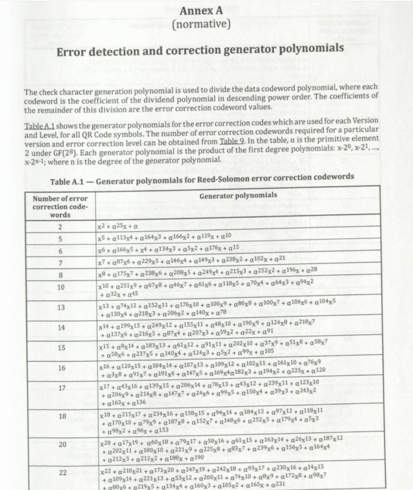

Recently I was reading through the ISO specification of QR codes when I came across a chart that simultaneously confused me and piqued my interest.

The introduction paragraph clearly states where the polynomials are derived from; $(x-2^0)(x-2^1)...(x-2^{n-1})$, and yet it just gives you all the expansions of that product immediately. The subtext here is clearly *"This is difficult, so don't bother"*. However, what the qr-code specification doesn't understand is both how unemployed I am, and my propensity to bother a lot.

This silly little chart -- that you are clearly supposed to just take at face value, manually enter into your code, and then move on with -- sent me down a week long rabbit hole exploring finite field arithmetic, Gaussian polynomials, q-analogs, and my own sanity.

I hope that I can introduce the concepts that lead to this chart being the way it is in an exploratory and thorough way. Many of the resources I found online are quite guilty of just "pulling formulas out of hats" and expecting you to accept them. That's fine for busy people and professionals who already know this stuff but my goal in this blog post is to convince you that this chart *really* is the expansions of the product of first degree polynomials $(x-2^0)(x-2^1)...(x-2^{n-1})$ by showing you how we can go about deriving each of the coefficients -- hopefully without too many formulas from hats.

When I went about researching this topic, I was often more confused why things *aren't* the way they are than why they *are* that way. I hope to make this topic more understandable by highlighting these mistakes.

Understanding these polynomials is just one part of understanding Reed-Solomon error correcting which in itself is just one part of QR codes themselves, but those are out of the scope of this post. I hope to make a post on them at a later date!

For now our motivation is to take the chart "in a vacuum" and ask **"Why is this chart the way it is?"**

This post will assume some understanding of group theory and discrete math for its explanations. (Especially proof by induction, my beloved)

## Exploring for ourselves.

To start we can try to do the simpler cases by hand to see if they make sense to us.

In the case that n=2, we have:
$$(x-2^0)(x-2^1)$$

With FOILing we can get:
$$x^2 + 2^1x + 2^0x + 2^1 * 2^0 = x^2 + (2^1 + 2^0)x + 2^1$$

It would appear we can simplify this to: $x^2 + 3x + 2$, but this is the most dangerous kind of mistake you can make: the one that yields the correct answer for the wrong reason! I will get in to why it is *correct* when I explain Galois fields, but for why is it wrong: Lets assume that the table is correct and compare our result with the table's:

For $n=2$ the corresponding generator polynomial is $x^2 + \\alpha^{25}x + \\alpha$. That would mean that $\\alpha=2$ and $\\alpha^{25}=(2^0+2^1)$. If we were to just assume that $2$ represents a real number, then by letting $\\alpha^{25}=3$ we get $2^{25} = 3$. This is clearly not the case in $\\mathbb{R}$. But then where is it the case that $2^1 + 2^0 = 2^{25}$?

The nature of the polynomials we are working with is explained in the table introduction; "In the table, $\alpha$ is the primitive element $2$ under $GF(2^{8})$". That confirms that $\alpha = 2$. If you are like me though, this explanation raises far more questions than it answers. Lets first look at what $GF$ means.

## Part 1: Galois Field.

Motivating Galois fields is a matter of stripping away the nature of both polynomials and basic arithmetic to their cores. 

Without getting too much in to the nitty-gritty of error correcting, I will propose a (somewhat arbitrary) scenario of two communicating parties; a sender and a receiver. The sender chooses some data ($d$)(an arbitrary element from an agreed upon set$D$). We will assume the sender will perform some agreed upon arithmetic(+,-,*,/) operations($f$) on the data, which yields the message($m$) to send, and the receiver can get back the original data by doing the inverse of the operations($f^{-1}$) on the message. We will also restrict the parameters of $f$ to be in the agreed upon set. What we ultimately want is a set that is *closed* under operations defined, and therefore closed under $f$.
From this scenario I will propose 2 heuristics: 
  1. "It is desirable that when a sender does an arithmetic operation on the data, the receiver can perfectly 'undo' that operation."
  2. "It is desirable that the size of the message sent is constrained in some way (ie. not infinitely large)."

With these heuristics in mind, we can begin to understand why we can't use real numbers, or any infinite set for the "number" we send.
If we were to try to use real numbers, there may be cases where the sender sends an irrational number, in which case its size can't be bounded. Even if we restrict our numbers to rational numbers, there may be cases where the agreed upon operation yields infinitely large rational numbers. We can't use floating point numbers either because they are not associative or distributive and plain integers are out the door because you can't define division precisely. (if the sender had $d=5$ and $f(x)=x/2$, then $m=2$, but the receiver doesn't know if that means $d=4$ or $d=5$!)

So from this impromptu poll of common sets of numbers mathemeticians and programmers use, we come up short for our desired traits. This makes us wonder: **Wouldn't it be nice if there was some kind of numbers that had these traits?!**

As it turns out, what we are looking for is a Galois Field!

To dip our toes in this process we can look 
